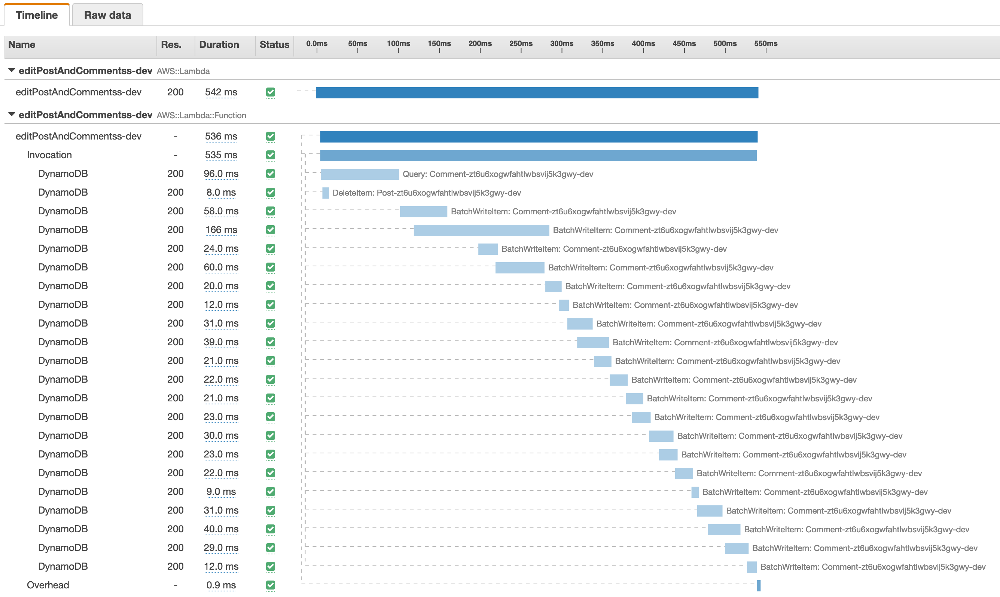

# Performance test

## Prerequisits
* navigate to directory `performance-test`
* run `pip install -r requirements.txt`

## Prepare data
* update `create-blog-post-and-comments.py` with your `APPSYNC_ENDPOINT_DEV` and `API_KEY`
* run `python create-blog-post-and-comments.py`.
  This can take a while, we are creating a 500 comments by executing 1000 requests to create one comment.
  Fortunately this isn'nt the performance we want to measure. 
  In real life comments will always be created one by one if a user creates a comment on a post.

## Test our mutation
Now that both the post and the 500 comments of the post have been created let's check the performance of the mutation.
* Update `delete-post-and-comments.py` with your `APPSYNC_ENDPOINT_DEV`, `API_KEY` and `POST_ID`.
  You received the postId from execting the above step where you initialized the data
* Run `python delete-post-and-comments.py`. 
  This execute the `deletePostAndComments` mutation.
  Thus, deleting both the post and it's 500 commment.
  You can now check the XRAY console to checkout how it performed!

